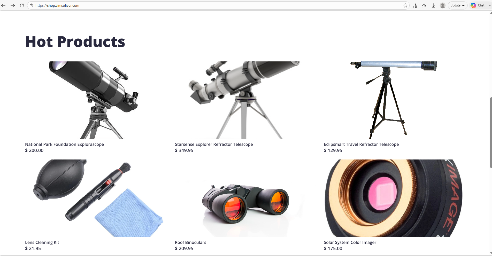
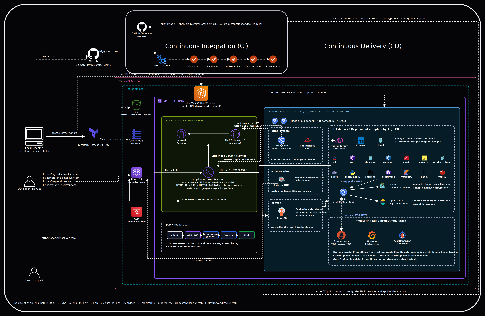
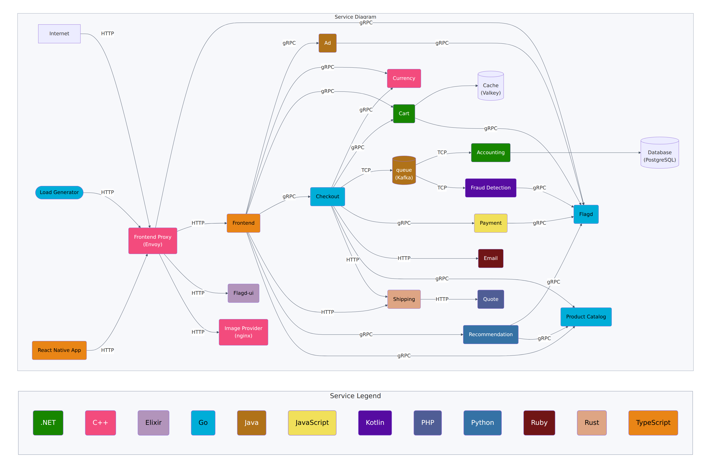
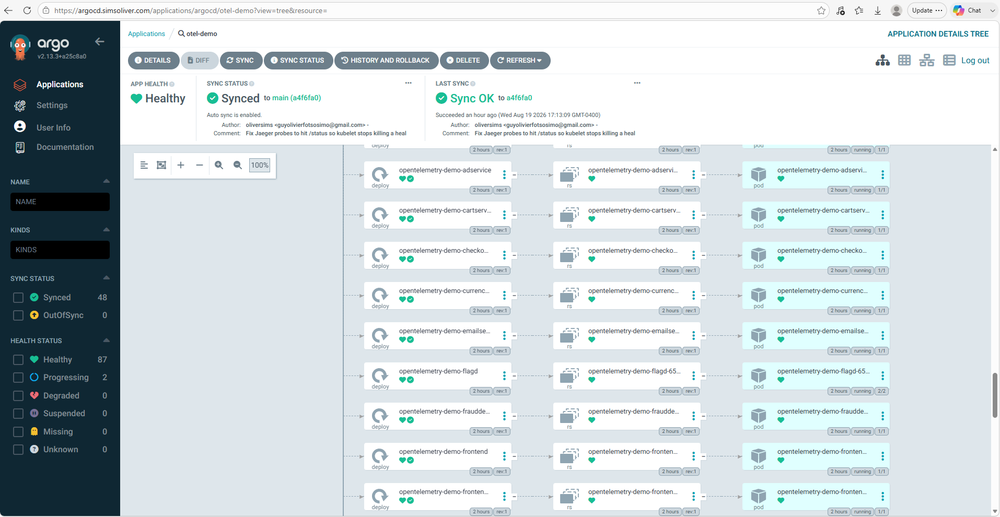
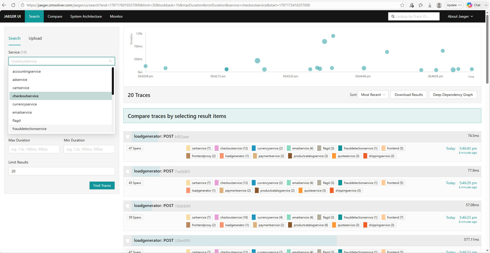
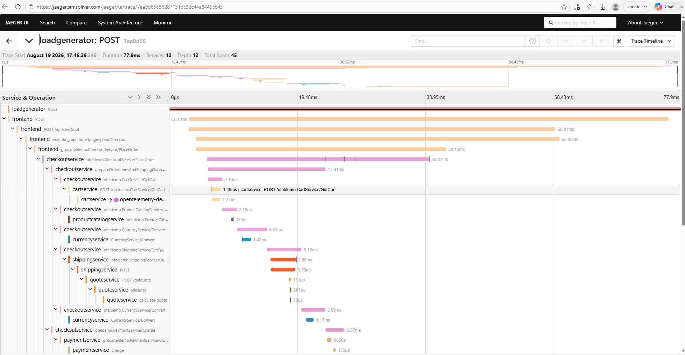
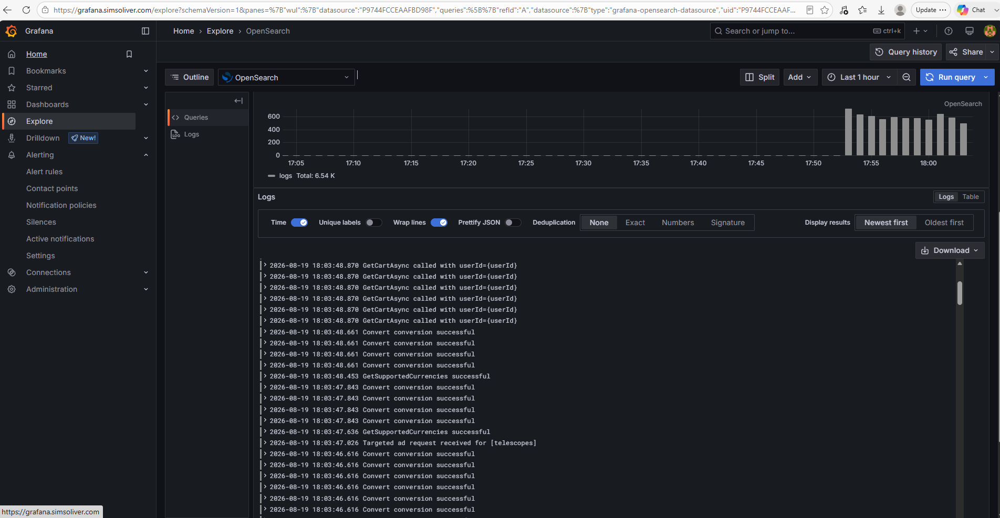
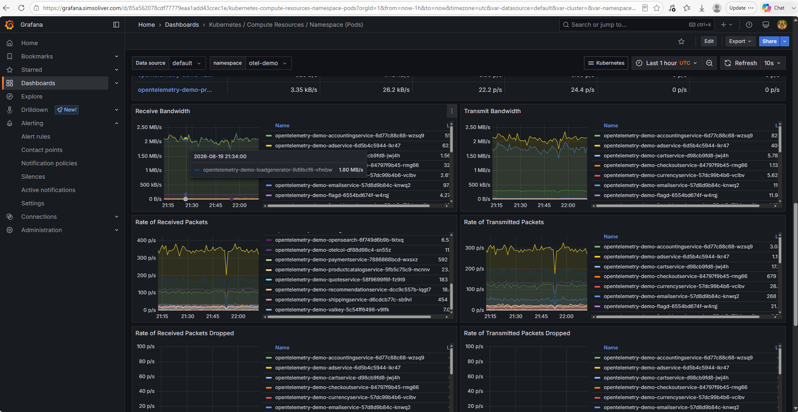
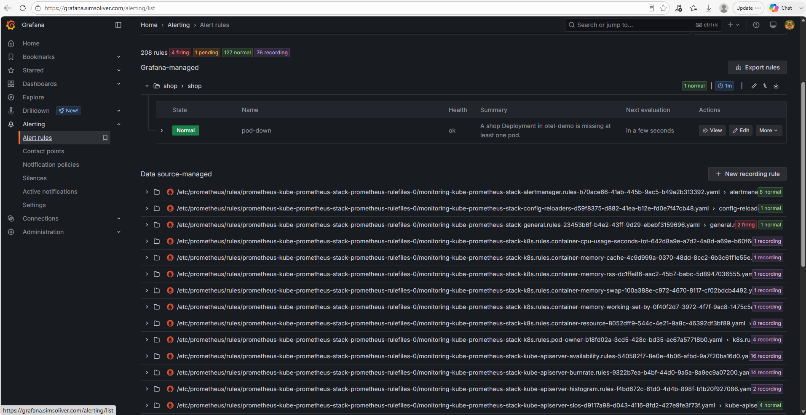

<p align="center">
  <h1 align="center">Astronomy Shop</h1>
  <p align="center">
    A production-style DevOps platform for a polyglot e-commerce storefront<br/>
    on <strong>Amazon EKS</strong>, delivered with <strong>Terraform</strong>, <strong>Argo CD</strong>, and full-stack observability.
  </p>
</p>

<p align="center">
  
  
  
  
  
  
</p>

<p align="center">
  <a href="#architecture">Architecture</a> ·
  <a href="#what-this-project-demonstrates">Outcomes</a> ·
  <a href="#infrastructure-as-code">Infrastructure</a> ·
  <a href="#gitops--ci">GitOps & CI</a> ·
  <a href="#observability">Observability</a> ·
  <a href="#repository-layout">Layout</a>
</p>

---

## Overview

This repository is an end-to-end cloud platform: a multi-service online shop running on a private Amazon EKS cluster, with HTTPS on a custom domain, GitOps delivery, and traces, metrics, logs, and Slack alerts.

The storefront is a distributed checkout flow — catalog, cart, payment, shipping, recommendations, and supporting services — written in several languages and talking over gRPC and HTTP. The platform around it is the focus of the work: how that system is provisioned, exposed, deployed, and observed.

When the stack is applied, these hostnames are served from one internet-facing Application Load Balancer:

| Surface | URL | Role |
| --- | --- | --- |
| Shop | [https://shop.simsoliver.com](https://shop.simsoliver.com) | Public storefront |
| Argo CD | [https://argocd.simsoliver.com](https://argocd.simsoliver.com) | GitOps control plane |
| Grafana | [https://grafana.simsoliver.com](https://grafana.simsoliver.com) | Metrics, logs, and alerts |
| Jaeger | [https://jaeger.simsoliver.com](https://jaeger.simsoliver.com) | Distributed traces |

<p align="center">
  
  <br/>
  <em>Live storefront served over HTTPS on shop.simsoliver.com</em>
</p>

---

## What this project demonstrates

- **Infrastructure as Code** — eight Terraform stacks, remote S3 state, and DynamoDB locking
- **Secure EKS networking** — three-AZ VPC, private worker nodes, NAT egress, public API restricted by CIDR
- **Kubernetes ingress** — AWS Load Balancer Controller, ACM wildcard certificate, ExternalDNS, Route 53
- **GitOps** — Argo CD watches `main` and applies `kubernetes/` automatically
- **CI that actually deploys** — GitHub Actions builds, tests, lints, publishes to GHCR, and updates the Deployment image
- **Observability** — Prometheus, Grafana, Jaeger, OpenSearch, and a Grafana-managed Slack alert when a shop Deployment is short of pods
- **Operational hygiene** — ordered apply and destroy scripts so the cluster can be stood up and torn down without leftover ALBs or NAT gateways

---

## Architecture

<p align="center">
  
  <br/>
  <em>CI on GitHub Actions, CD with Argo CD, and a three-AZ EKS platform in us-east-1</em>
</p>

### Data path

1. A shopper hits `shop.simsoliver.com`. Route 53 answers with the shared ALB.
2. TLS terminates on the ALB using an ACM certificate for `simsoliver.com` and `*.simsoliver.com`.
3. The ALB forwards to the frontend-proxy Service (Envoy) in the shop namespace.
4. Envoy routes to frontend, Jaeger UI, and the rest of the mesh over in-cluster DNS.
5. Each service emits OpenTelemetry signals. The collector exports traces to Jaeger, logs to OpenSearch, and metrics toward Prometheus.
6. Grafana is the operator console: Kubernetes dashboards, log explore, and the `pod-down` alert.

### Platform sketch

```text
Developer ──push──► GitHub ──workflow──► GHCR
                         │
                         └── commit image tag into kubernetes/
                                      │
Argo CD ◄──── watches main ───────────┘
   │
   └── applies manifests to EKS (private nodes, 3 AZs)
            │
         AWS ALB ── TLS ── shop / argocd / grafana / jaeger
            │
         Route 53  (ExternalDNS)
```

---

## Technology stack

| Layer | Choice |
| --- | --- |
| Cloud | AWS `us-east-1` |
| Compute | Amazon EKS **1.34**, managed node group `t3.medium` × 4 (on-demand) |
| Networking | VPC `10.0.0.0/16`, public + private subnets in three AZs, NAT × 3, S3 gateway endpoint |
| TLS & DNS | ACM wildcard cert, Route 53, ExternalDNS |
| Ingress | AWS Load Balancer Controller, one ALB group `my-eks-cluster-public` |
| GitOps | Argo CD, automated sync from this repository |
| CI | GitHub Actions (`product-catalog-ci`) |
| Images | GitHub Container Registry (`ghcr.io/oliversims/...`) |
| Metrics | kube-prometheus-stack (Prometheus, Grafana, kube-state-metrics) |
| Traces | OpenTelemetry Collector → Jaeger |
| Logs | OpenSearch, queried from Grafana |
| Alerting | Grafana contact point → Slack (`#alert-optl`) |

---

## Application

The shop is a polyglot microservice catalog. Checkout spans frontend, cart, catalog, currency, payment, shipping, quote, email, recommendation, ad, accounting, and fraud detection, plus Kafka, Valkey, Flagd, and a load generator.

<p align="center">
  
  <br/>
  <em>Shop service map — languages and request paths for a checkout</em>
</p>

<p align="center">
  
  <br/>
  <em>Argo CD Application: Synced to main, Healthy, 22 workloads in the shop namespace</em>
</p>

| Area | Services |
| --- | --- |
| Storefront | Frontend (TypeScript), frontend-proxy (Envoy), image provider |
| Commerce | Product catalog, cart, checkout, payment, shipping, quote, email |
| Intelligence | Recommendation, ad, fraud detection, accounting |
| Data & flags | Valkey, Kafka, PostgreSQL (accounting), Flagd |
| Telemetry | OpenTelemetry Collector, Jaeger, OpenSearch |
| Traffic | Load generator |

Kubernetes manifests live under `kubernetes/<service>/` (Deployment + Service, plus Ingress where the app is public). Argo CD recursively applies that tree into the shop namespace. `kubernetes/complete-deploy.yaml` is excluded so resources are not created twice.

---

## Infrastructure as Code

Terraform is split so each concern has its own state. Remote state sits in S3; a DynamoDB table serializes applies.

| Stack | Path | Purpose |
| --- | --- | --- |
| 00 | `eks-install/00-s3` | State bucket and lock table (local state) |
| 01 | `eks-install/01-vpc` | VPC, subnets, IGW, NAT, routes, S3 endpoint |
| 02 | `eks-install/02-eks` | EKS control plane, IAM, managed node group |
| 03 | `eks-install/03-acm` | ACM certificate for the domain |
| 04 | `eks-install/04-alb` | AWS Load Balancer Controller (Helm + Pod Identity) |
| 05 | `eks-install/05-external-dns` | ExternalDNS for Route 53 |
| 06 | `eks-install/06-argocd` | Argo CD and its Ingress |
| 07 | `eks-install/07-monitoring` | kube-prometheus-stack and Grafana Ingress |

Later stacks read earlier outputs through `terraform_remote_state`. Workers stay in private subnets. The EKS public API is allowed only from the operator CIDR in `02-eks`.

Bring-up and teardown are scripted in order:

```bash
# cluster and add-ons (after 00-s3 and backend bucket names are set)
cd eks-install
./apply-00-to-07.sh

# GitOps the shop
kubectl apply -f argocd/application.yaml

# reverse order; destroy the shop namespace before Terraform
./destroy-07-to-00.sh
```

The versioned state bucket must be emptied before `00-s3` can delete it. That is expected with S3 versioning enabled.

---

## GitOps & CI

### Delivery model

Argo CD is the only path that creates shop workloads. The Application in `argocd/application.yaml` points at this repo, branch `main`, path `kubernetes/`. A merge to `main` is a deploy. There is no `kubectl apply` of individual shop charts in normal operation.

### Product-catalog pipeline

`.github/workflows/ci.yaml` is scoped to `src/product-catalog` so a docs change does not rebuild the service.

| Event | What runs |
| --- | --- |
| Pull request | Go **1.22** build, unit tests, golangci-lint |
| Push to `main` | Same checks, then linux/amd64 image → GHCR, then a commit that updates `kubernetes/productcatalog/deploy.yaml` |

The image tag includes the GitHub Actions run ID so every push is unique (`IfNotPresent` on the cluster will still pull a new tag). Argo CD sees the manifest change and rolls the Deployment. The GitHub token commit does not loop the workflow: the path filter is the Go module, not the YAML.

```text
PR / main
  ├─ build          go build + go test
  ├─ code-quality   golangci-lint
  ├─ docker         push ghcr.io/<owner>/...:productcatalogservice-<run_id>
  └─ updatek8s      sed the Deployment image, git push main
```

---

## Observability

Telemetry is first-class, not an add-on screenshot. Services instrument with OpenTelemetry. The collector is the fan-in point. Grafana is public; Prometheus and Alertmanager stay in-cluster.

### Traces

<p align="center">
  
</p>

<p align="center">
  
  <br/>
  <em>Checkout traces in Jaeger: load generator → frontend → checkout → cart, catalog, currency, payment, shipping</em>
</p>

### Logs

<p align="center">
  
  <br/>
  <em>Grafana Explore against OpenSearch: application logs from cart, currency, and related services</em>
</p>

### Metrics

<p align="center">
  
  <br/>
  <em>kube-prometheus-stack dashboards on the shop namespace (pod network and compute)</em>
</p>

### Alerts

A Grafana-managed rule `pod-down` watches kube-state-metrics. If a Deployment in the shop namespace is missing at least one replica, Grafana posts to Slack through a contact point (webhook kept out of Git).

<p align="center">
  
  <br/>
  <em>Rule pod-down in Normal while the shop Deployments have the expected replica count</em>
</p>

Grafana is deployed without persistence. After a Grafana pod restart the contact point and rule need to be recreated; Slack itself does not.

---

## Repository layout

```text
.
├── argocd/                 Argo CD Application (shop)
├── eks-install/
│   ├── 00-s3/ … 07-monitoring/
│   ├── apply-00-to-07.sh
│   └── destroy-07-to-00.sh
├── .github/workflows/      Product-catalog CI
├── images/                 Architecture and live-environment captures
├── kubernetes/             GitOps manifests (one folder per service)
└── src/                    Service source (CI currently covers product-catalog)
```

---

## Operating notes

- **Region:** `us-east-1`. Cluster name: `my-eks-cluster`.
- **Domain:** `simsoliver.com` must delegate to the Route 53 hosted zone Terraform creates, or ACM validation will sit on pending.
- **API access:** the operator public IP must match `public_access_cidrs` in `eks-install/02-eks` until the cluster is destroyed.
- **Images:** shop images are public on GHCR so nodes pull without an imagePullSecret.
- **Cost:** NAT gateways, EKS, and the ALB are the main bill. Destroy in reverse order when the demo is idle.
- **Secrets:** Slack webhook URLs never land in this repository.

Step-by-step restore and destroy checklists are in `restore.txt` and `destroy.txt`.

---

## License

This project is licensed under the Apache License 2.0. See [LICENSE](LICENSE).
